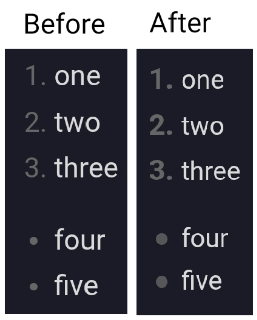

## Description

This code slightly increases the size of numbered and bulleted list markers.

However, its main advantage is that it ensures consistent marker sizes and text indentation across Reading and Preview modes.

***
- author: DOChrist
- link: https://github.com/DmitriyChrist/Custom_Obs_journal_DOC
***



## Code

```css
body {
    --list-bullet-end-padding: 0.2rem;
}

/*Appearance of the bulleted list marker in Reading and Live modes*/
.markdown-rendered .list-bullet:after,
.markdown-source-view.mod-cm6.is-live-preview  .list-bullet:after {
    width: 8px;
    height: 8px;
    opacity: 0.8;
    border-radius: 50%;
}

/*Appearance of the numbered list marker in Reading/Live/Source*/
.markdown-rendered ol > li::marker,
.markdown-source-view.mod-cm6 .cm-formatting-list-ol,
.markdown-source-view.mod-cm6.is-live-preview .cm-formatting-list-ol,
.markdown-source-view.mod-cm6.is-live-preview ol > li::marker,
.markdown-source-view.mod-cm6 ol > li::marker {
    font-size: 1.1em;
    font-weight: bold;
}

/*Appearance of the vertical line in Reading/Live/Source*/
.markdown-source-view.mod-cm6 .cm-indent::before,
.markdown-rendered.show-indentation-guide li > ul::before,
.markdown-rendered.show-indentation-guide li > ol::before {
    border-inline-end: 2px solid rgba(30, 161, 152, 1);
}

/* Indentation between the text and the marker for Live and Source */
.markdown-source-view.mod-cm6.is-live-preview .list-bullet,
.markdown-source-view.mod-cm6.is-live-preview .list-number,
.markdown-source-view.mod-cm6 .cm-formatting-list-ul,
.markdown-source-view.mod-cm6 .cm-formatting-list-ol {
    padding-inline-end: var(--list-bullet-end-padding);
}
```


