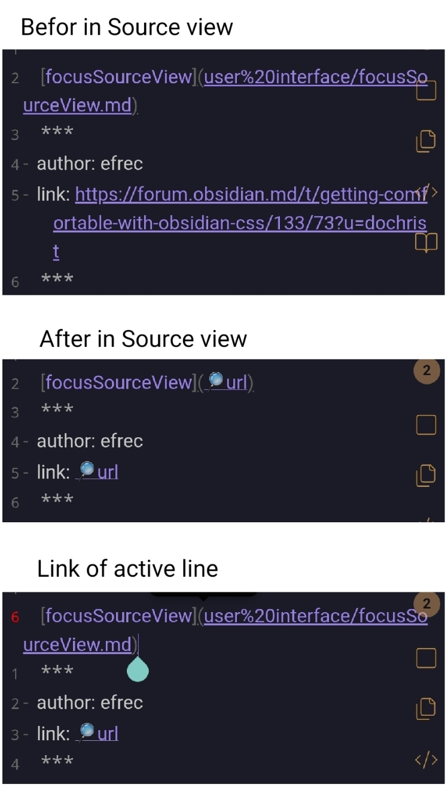

## Description

Sometimes it is necessary to reduce the informational noise from links in Source mode (especially on mobile). This snippet handles this very well.  
The original version of the author also hid HTML/CSS inline, but I consider this excessive and removed that part from the CSS code. You can view the original version at the link below.

***
- author: efrec
- link: https://forum.obsidian.md/t/getting-comfortable-with-obsidian-css/133/73
***



## Code

```css
/* * HIDING ELEMENTS * */

/** External links. Obsidian seems to think that all kinds of things are links, 
    there are man kinds of those links. This likely doesn't cover everything: */

.markdown-source-view .cm-line:not(.cm-active) .cm-url:not(.cm-formatting),
.markdown-source-view .cm-line:not(.cm-active) .cm-string.cm-url:not(.cm-formatting),
.markdown-source-view .cm-line:not(.cm-active) .cm-formatting.cm-link:not(.cm-formatting-link)+[class="cm-link"],
.markdown-source-view .cm-line:not(.cm-active) .cm-link.cm-inline-footnote:not(.cm-formatting, .cm-hmd-barelink)+.cm-inline-footnote-end+[class="cm-link"]
{
  font-size: 0;
}
/* Refill empty elements with an ellipsis: */
.markdown-source-view .cm-line:not(.cm-active) .cm-url:not(.cm-formatting)::after,
.markdown-source-view .cm-line:not(.cm-active) .cm-string.cm-url:not(.cm-formatting)::after,
.markdown-source-view .cm-line:not(.cm-active) .cm-formatting.cm-link:not(.cm-formatting-link)+[class="cm-link"]::after
{
  content: "🔎url";
  font-size: 1rem;
}

/*/////////////////////////*/
/* Text should resize in no more than +/- 5% step sizes. My decision is
    to use the same font size throughout: */
.markdown-source-view .cm-line {
  font-size: medium;
}
```


