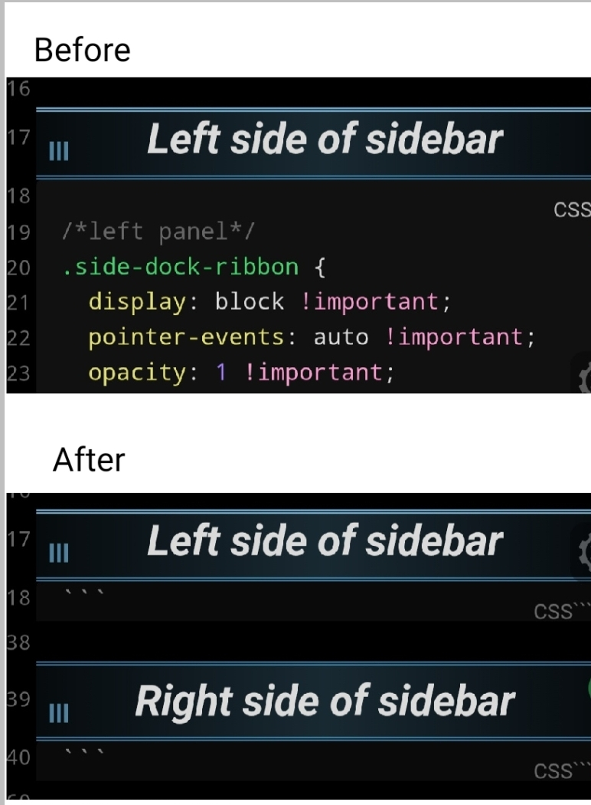

## Description
A pretty interesting code that hides code blocks in both Preview and Source modes.
- Important: add the `cssclasses: hidden-code` property to the note
- Warning: The issue is that the code-block remains hidden and doesn't appear even when you hover over it.

***
- author: efrec
- link: https://forum.obsidian.md/t/getting-comfortable-with-obsidian-css/133/72

***



## Code

```css
/*
 * hidden-code.css
 * In these notes      : daily, weekly, monthly, quarterly, and yearly notes
 * hide these elements : dataview queries and (some amount of) their surroundings
 */

/* When the code block gets hidden, the line numbers in the gutters get crushed together.
    This is caused by a setting applied directly to the element; which we can find: */
.hidden-code.markdown-source-view .cm-gutterElement[style*="height: 0px;"] {
  display: none;
}

/* * Start of different options for hiding code blocks. * */

/* (1) Nuke everything from the first code block to the end. */
/* .hidden-code.markdown-source-view .cm-line.HyperMD-codeblock-begin,
.hidden-code.markdown-source-view .cm-line.HyperMD-codeblock-begin ~ * {
    display: none;
} */

/* (2) Be a bit more surgical with it: hide the code blocks, fade their surroundings. */
/* .hidden-code.markdown-source-view .cm-line.HyperMD-codeblock,
.hidden-code.markdown-source-view .cm-line.HyperMD-codeblock + div {
  display: none;
}
.hidden-code.markdown-source-view .cm-line.HyperMD-codeblock-begin,
.hidden-code.markdown-source-view .cm-line.HyperMD-codeblock-begin ~ * {
  font-size: medium;
  opacity: 25%;
} */

/* (3) Be even more permissive: Show the code block but hide (most of) its contents.
        This option works even if we don't know the structure of the note. Huge plus. */
.hidden-code.markdown-source-view
  .cm-line.HyperMD-codeblock:not(.HyperMD-codeblock-begin) {
  display: none;
}
.hidden-code.markdown-source-view .cm-line.HyperMD-codeblock-begin {
  font-size: medium;
  opacity: 60%;
}
.hidden-code.markdown-source-view
  .cm-line.HyperMD-codeblock-begin
  > span::after {
  content: "```";
}
```


